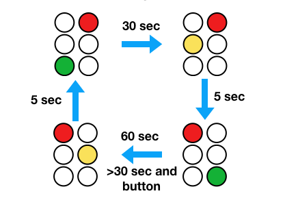

# Project 1 - Foundations

In an actual deployment of Raft, servers run concurrently and send messages to
each other.  In this project, we work out some foundational programming
techniques related to both of these topics (message passing and concurrency).

## Part 1 - Message Passing

Raft involves servers that send messages to each other.  Thus, our
first task is to implement two functions that do just that
using a network socket:

```
# transport.py

def send_message(sock, msg):
    ...

def recv_message(sock):
    ...
```

A critical feature of these functions is that they work with messages
as an "indivisible" unit.  A message is assumed to be an arbitrary
array of bytes.  When sent, the entire message is sent as one
unit.  When received, the entire message is returned exactly as it was
sent.  This behavior is a bit different than a normal network socket
where `send()` and `recv()` operations often introduce fragmentation
and return partial data.

To solve this problem, you should have your functions work with
size-prefixed data.  That is, all low-level I/O should embed a size
field that indicates how many bytes of data comprise the message.
Functions such as `recv_message()` should use the size to know exactly
how big the message is when it's received.

### Testing

Your `send_message()` and `recv_message()` functions should work with
messages of arbitrary size.  Thus, you should test your functions with
both small messages and large messages.  One way to test this is to
write an echo server roughly like this:

```
import transport

def echo_server(sock):
    while True:
         msg = transport.recv_message(sock)
         transport.send_message(sock, msg)

def main():
    from socket import socket, AF_INET, SOCK_STREAM
    sock = socket(AF_INET, SOCK_STREAM)
    sock.bind(('', 15000))
    sock.listen(1)
    client, addr = sock.accept()
    try:
        echo_server(client)
    finally:
        client.close()
	sock.close()

main()
```

Then, write an echo-client that tries different message sizes:

```
import transport

def echo_test(sock):
    for n in range(0, 8):
        msg = b'x'*(10**n)         # 1, 10, 100, 1000, 10000, bytes etc...
        transport.send_message(sock, msg)
        response = transport.recv_message(sock)
        assert msg == response

def main():
    from socket import socket, AF_INET, SOCK_STREAM
    sock = socket(AF_INET, SOCK_STREAM)
    sock.connect(('localhost', 15000))
    echo_test(sock)
    sock.close()

main()
```

## Part 2 : Implement a Key-Value Store

Using your message passing functions, your next task is to implement a
networked key-value store.  A key value store is basically a
dictionary that lives on the network.  For example:

```
data = { }

def get(key):
    return data.get(key)

def set(key, value):
    data[key] = value

def delete(key):
    if key in data:
        del data[key]
```

Write a program `kvserver.py` that contains the key-value store data
and responds to client messages.  You'll run the server as a
standalone program like this:

```
bash % python kvserver.py
KV Server listening on port 12345
```

Next, write a `kvclient.py` program that allows remote access to the
server using a command-line interface like this:

```
bash % python kvclient.py set foo hello
ok
bash % python kvclient.py get foo
hello
bash % python kvclient.py delete foo
ok
bash %
```

Here, the `kvclient.py` program accepts three commands `set`, `get`,
and `delete` that interact with the server.

To make this work, you will need some configuration data related to the
server network address and port number.  Go ahead and hard-code that
information into the `kvserver.py` and `kvclient.py` programs.  You
can always make it more flexible later.

## Part 3 - Command and Control

You have been been tasked with writing the control software for a
simple traffic light.  So, let's think about traffic lights for a
moment.  First, there is the light itself:


It shows a different color in each direction.  For this exercise,
assume that there are just two directions (e.g., NORTH-SOUTH,
and EAST-WEST).  A traffic light might also have a pedestrian push
button.  For example:


Assume that there is just one such button for this light. Perhaps one
of the directions is a very busy road with a long signal
time. Pressing the button shortens the light cycle in that direction
only.

### Operational States

A traffic light operates by stepping through a specific sequence of
timed states wherein the lights change colors.  However, inputs
such as a pedestrian button act as events that might alter the cycle.
Here's an example of a possible state cycle:



In this diagram, the light shows green for 30 seconds in one direction
and 60 seconds in the other.  Yellow lights always show for 5 seconds
as the light changes.  A pedestrian push-button can shorten the time of the
60-second light, but that light must still show green for at least 30
seconds before changing (i.e., pressing the button won't cause the
light to instantly change if it just became green).

### Some Light-Building Components

Suppose that you're given a collection of pre-built components for
constructing a traffic light including some light display modules and
a push button module.  And for some reason, suppose that all of these
were internet-enabled and written in Python (okay, a really bad idea,
but work with me).

In the directory `traffic` you'll find a file `light.py`.  This is a
UDP-controlled light module.  In a separate terminal window, run it:

```
bash $ python traffic/light.py "East-West" 10000
East-West: R
```

Now, in a completely separate window, open up an interactive Python
session and send it some messages to change the light color:

```
>>> from socket import socket, AF_INET, SOCK_DGRAM
>>> sock = socket(AF_INET, SOCK_DGRAM)
>>> sock.sendto(b'G', ('localhost', 10000))
>>>
```

You should see the output of the light change.  Try sending messages
such as `b'R'`, `b'Y'`, `b'G'`.  That's about all there is to a
light. If you want multiple lights, run more copies of the `light.py`
program in different terminal windows using different port numbers.

The file `button.py` has code for a push button.  Run it in a separate
terminal window:

```
bash $ python traffic/button.py localhost 12000
Button: [Press Return]
```

Try pressing `return` a few times.  Okay, very exciting.  The button
program sends a message to a host/port address of your choosing.  Open
a Python session in a different terminal window and receive the
messages:

```
>>> from socket import socket, AF_INET, SOCK_DGRAM
>>> sock = socket(AF_INET, SOCK_DGRAM)
>>> sock.bind(('',12000))
>>> while True:
...      msg, addr = sock.recvfrom(1024)
...      print("You pressed it!")
...
```

With this running, go to the window with the `button.py` program and
press return.  You should now see the "You pressed it!" message being
displayed in the other terminal.

### Your Task

Your task is to write the control software for the traffic light
described in this problem. Specifically, here's the light
configuration:

1. A single East-West light
2. A single North-South light
3. A single push button to change the North-South light to red.

Here are the behaviors that need to be encoded in your controller:

1.  The East-West light stays green for 30 seconds.
2.  The North-South light stays green for 60 seconds. 
3.  Yellow lights always last 5 seconds.
4.  The push-button causes the North-South light to change immediately
    if it has been green for more than 30 seconds.  If less than 30
    seconds have elapsed, the light will change once it has been green for
    30 seconds.

### How to Proceed

To solve this problem, it first helps to understand that there are
number of things happening concurrently.  First, there is time
evolution.  So, somehow your controller needs to keep an internal
clock to manage light cycle times.  Second, there are incoming events
(the button press).  So, the controller also needs to monitor that.

The configuration of the whole system is rather complicated.  For
example, you'll have two `light.py` programs and a `button.py` program
running at the same time as your controller when in operation.  This
makes testing and debugging all the more challenging.  In fact, it
might be challenging just to put everything together in your IDE or
terminal as you'll need to be running at least 4 programs at once.
Figuring out how to manage this complexity is part of the exercise.

## How this pertains to Raft

A typical Raft configuration consists of five independently running
servers, each operating concurrently, and responding to events
(messages, timers, etc.).  The techniques that you figure out for the
traffic light will be applicable later.


