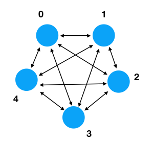

# Project 5 - Modeling The Raft Network

A typical deployment of Raft might involve 3, 5, or 7 servers.  These
servers are fully interconnected with each other in the sense that any
server can send a message to any other server.  Thus, the network
topology looks something like this:



Your task is to model the Raft network with some kind of
higher-level object that allows you to simulate message
transport.  The purpose of this is to facilitate testing
and to make it possible to understand other parts of the
Raft algorithm without getting bogged down in system details (i.e., sockets).
As an example, here's one possibility for how it might work:

```
>>> from raftnet import RaftNetwork
>>> net = RaftNetwork(5)         # A network of 5 nodes
>>> node1 = net.create_node(1)   # Create node 1
>>> node3 = net.create_node(3)   # Create node 3
>>> node1.send(3, 'Hello')       # Send 'Hello' to node 3
>>> msg = node3.receive()
>>> msg
'Hello'
>>>
```

In some sense, we're doing a bit of high-level "wishful thinking" and
design here. We know that Raft requires multiple machines.  We know
that those machines communicate on the network by sending messages.
Thus, we need to devise some strategy for interacting with it.  The
`RaftNetwork` object above is that.  You don't necessarily need to
exactly follow the same programming interface as shown, but you need to devise
*something*.  Behind the scenes, use plain data structures like lists
and dicts to manage the messages (i.e., when executing an operation
like `node1.send(3, 'Hello')`, the message could be stored inside
the associated `RaftNetwork` instance until the `node3.receive()`
operation retrieves it).

## Some Technical Requirements

The networking layer of Raft has some critical properties that need to
be observed in order to make the algorithm reliable. Some of these
properties are going to seem quite subtle now.

1. Sending a message is **always** instant and asynchronous.  That is,
the `send()` operation never waits for a message to be delivered to
the receiver.  Sending a message is like dropping a letter in the
mailbox at the post office.  Once you've done it, you walk away.  How
and when the message gets delivered is not your problem.

2. Message delivery does not have to be reliable.  If you send a
message, there is no guarantee that it gets delivered. The destination
server could be crashed or the network broken in some manner.  Again,
it's like putting a letter in the mailbox.  Once you've dropped it
off, you have no control over what happens to it.  Your implementation
of `RaftNetwork` could be instrumented in a way that simulates this.
For example, if you wanted to simulate a dead server, you could have
a node throw all of its messages away.  Again, think testing.

3. A node can receive messages from any server at any time and in any
order.  Thus, the `receive()` operation should just return any message
regardless of where it came from.   If it's important to know the
sender, then the sender should include their return address in the
message itself.  Again, it's like the post office.  Ponder: Can a node
send a message to itself?

4. For the purposes of modeling, if no messages are available, have
`receive()` return `None`.  In this sense, `receive()` is like a
"polling" operation that always returns immediately regardless of
whether or not there are messages. The alternative is to implement
some kind of blocking (i.e., waiting).  However, blocking requires the
use of threads or some other concurrency primitives.  Let's not do
that. Make it non-blocking so you can work with the "network" in a
simplified environment.

Some of these points may seem counterintuitive at first--especially
those about unreliable networking.  However, the Raft algorithm is
designed to work with this.  Thus, it is ok for you to write code that
throws messages away or deals with errors in some kind of "harsh"
manner. This runs counter to what we are often taught as
programmers. You might be inclined to report some kind of nice error
when things don't work. NO. Just throw the message out and
forget about it.

## Considerations for Testing

The Raft network is a critical component of the whole project.
However, one challenge concerns testing.  For example, how do you
actually test the implementation without running it on an actual
network?  In some sense, that's what we're trying to figure out here.

Ideally, the `RaftNetwork` object should be something that can
be created, debugged, and tested in a simple environment.
It's also something that could be instrumented with some controls
to simulate various network failures. For example, could you simulate a dead
network link with some kind of method?

```
net = RaftNetwork(5)
net.disable(2)          # Disable all communication with server 2
...
net.enable(2)           # Enable communication with server 2
```

I don't know if this would be useful or not, but testing the full Raft
algorithm later becomes quite complicated.  It might be useful to have
the ability to turn some dials to do things with the network such as
simulate dead machines, bad connections, and other things.
